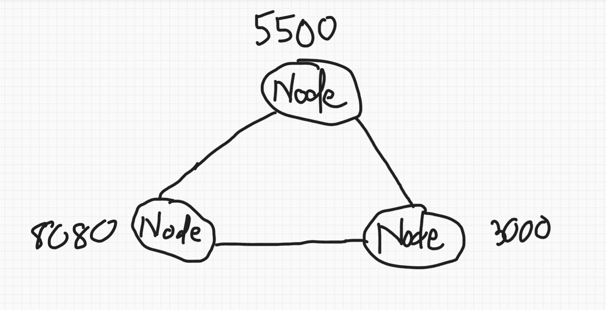

<p align="center">
  
</p>

<p align="center">
  <a href="https://github.com/trgchinhh/blockchain-cpp">
    
  </a>
  <a href="LICENSE">
    
  </a>
  <a href="https://github.com/trgchinhh">
    
  </a>
</p>

## Blockchain Miner

Dự án này là một ứng dụng giả lập (mô phỏng) mạng lưới Blockchain phân tán viết bằng ngôn ngữ C++. Phiên bản này tập trung tích hợp những cơ chế cốt lõi của 1 blockchain như cơ chế bảo mật mã hóa bất đối xứng bằng thuật toán RSA (thông qua thư viện Crypto++), cơ chế đồng thuận Proof of Work dựa trên hàm băm mật mã học SHA-256, mạng ngang hàng (P2P) (thông qua thư viện Winsocket) cho phép nhiều node cùng tham gia đào và đồng bộ chuỗi theo thời gian thực và ghi Log hệ thống (thông qua thư viện MiniLog).


## Tổng quan kiến trúc & Quy trình vận hành

Hệ thống hoạt động như một chu trình khép kín, có sự tham gia đồng thời của **nhiều node** kết nối với nhau qua P2P:

```bash
  [Khởi tạo Ví] ──> [Tạo & Ký Giao dịch] ──> [Phát tán qua P2P] ──> [Đua đào PoW đa Node] ──> [Node thắng Broadcast] ──> [Các Node còn lại đồng bộ]
   (RSA Keys)         (Private Key)             (Broadcast Tx)         (Race, tìm Nonce)         (Kèm Hash/Nonce)          (Xác thực & Dừng đào)
```

Khi 1 node bắt đầu đào 1 khối, nó sẽ phát yêu cầu cho toàn mạng, mọi node đang kết nối sẽ cùng tham gia đua đào trên cùng 1 bộ giao dịch. Node nào tìm ra `số nonce` hợp lệ trước sẽ phát tán khối đã đào (kèm `nonce`, `hash`, `thời gian` thật) cho toàn mạng; các node còn lại nhận được tin sẽ dừng đào và tự băm lại để xác thực khối nhận được, rồi đồng bộ vào chuỗi và dọn sạch các giao dịch đã được đào khỏi hàng chờ của mình.

## Quy trình chạy chương trình

| Bước | Việc làm | Giải thích |
| :---: | :--- | :--- |
| **1** | Tạo ví | Chương trình tạo cặp khóa RSA 1024-bit cho từng người dùng, lưu vào `public_keys.json` và `private_keys.json` |
| **2** | Chạy Node P2P | Nhập Port muốn chạy, có thể chọn kết nối tới 1 node khác đang chạy (nhập Port của nó). Nếu kết nối được thì tự động xin đồng bộ lại chain từ node đó |
| **3** | Tạo giao dịch | Random ra vài giao dịch giữa các user, ký bằng private key của người gửi, rồi gửi cho các node khác |
| **4** | Xác thực giao dịch | Node nhận được giao dịch sẽ lấy public key người gửi ra kiểm tra chữ ký có đúng không, đúng thì cho vào hàng chờ, sai thì bỏ giao dịch |
| **5** | Rủ node khác đào | Khi bấm đào, node gửi tin nhắn `START_MINING` rủ những node khác cùng đào chung các giao dịch đang chờ trong hàng đợi. Node nào cũng bắt đầu đào từ nonce 0. |
| **6** | Đào (PoW) | Mỗi node tự tăng `nonce` lên rồi băm SHA-256 tới khi nào ra hash đủ số 0 ở đầu thì dừng. Node nào ra trước thì thắng, mấy node còn lại thấy có kết quả từ mạng gửi về thì dừng đào |
| **7** | Đồng bộ block | Node thắng gửi block vừa đào (kèm nonce, hash, giờ đào) cho cả mạng. Các node còn lại nhận được thì tự băm lại kiểm tra rồi mới thêm vào chain của mình |
| **8** | Lưu lại | Mỗi lần có block mới hợp lệ thì lưu thêm vào file `valid_blocks.json` để coi lại sau này. |

## Menu chính khi chạy chương trình

Sau khi khởi tạo ví và kết nối mạng P2P (nếu có), chương trình hiển thị menu tương tác:

```txt
[01] Tạo/phát tán giao dịch
[02] Kiểm tra hàng chờ
[03] Bắt đầu đào block
[04] Xem lịch sử chuỗi
[05] Thoát
```

| Lựa chọn | Chức năng |
| :---: | :--- |
| **1** | Sinh ngẫu nhiên các giao dịch giữa các ví, ký RSA, và phát tán cho toàn mạng P2P |
| **2** | Xem chi tiết các giao dịch hiện đang nằm trong hàng chờ |
| **3** | Gửi yêu cầu đào cho toàn mạng, tự tham gia đua đào cùng lúc với các Node khác |
| **4** | Xem lịch sử toàn bộ khối trong chuỗi |
| **5** | Dừng server P2P và thoát chương trình |

## Các tính năng nâng cấp nổi bật

* **Mạng ngang hàng P2P (TCP Socket):** Nhiều node có thể kết nối trực tiếp với nhau qua IP:Port, tự động lan truyền giao dịch và block mới cho các Peer khác trong mạng.
* **Đua đào đa Node (Mining Race):** Khi 1 node bắt đầu đào, toàn bộ node kết nối cùng tham gia đua trên cùng 1 bộ giao dịch, node nào tìm ra nonce hợp lệ trước sẽ thắng (mô phỏng quá trình đào coin), các node còn lại tự động hủy đào giữa chừng để tránh lãng phí tài nguyên.
* **Xác thực khối nhận từ mạng:** Các node khác nhận block từ Peer đã xác thực và tự băm lại theo đúng `nonce` nhận được để đối chiếu với `hash` công bố, và kiểm tra block có thật sự đạt độ khó cấu hình hay không.
* **Đồng bộ Mempool toàn mạng:** Khi 1 block được chấp nhận, các giao dịch đã được đào sẽ tự động bị loại khỏi hàng chờ trên mọi node, tránh tình trạng giao dịch bị đào nhiều lần hoặc tồn đọng sai lệch giữa các node.
* **Bảo mật ví điện tử (RSA Keypair):** Tự động sinh ngẫu nhiên cặp khóa Private Key và Public Key cho toàn bộ user, quản lý lưu trữ an toàn trong tệp Json.
* **Chữ ký số giao dịch (RSA Signature):** Người gửi bắt buộc phải ký vào gói dữ liệu giao dịch bằng Private Key. Hệ thống sử dụng Public Key để xác thực, chống gian lận dữ liệu và mạo danh ví người khác.
* **Lưu trữ lịch sử khối hợp lệ:** Mỗi block được xác thực thành công sẽ được ghi lại đầy đủ (id, hash, nonce, thời gian đào) vào file Json riêng, phục vụ tra cứu.
* **Ghi log bằng MiniLog:** Toàn bộ quá trình từ lúc bắt đầu đến kết thúc chương trình (đào block, nhận/gửi P2P, lỗi xác thực...) đều được ghi lại vào file log riêng thông qua thư viện `MiniLog` tự viết, phân loại theo từng cấp độ (info, success, warning, error), tiện theo dõi để phân tích mà không cần in ra terminal.

---

## Mẫu public key và private key lưu vào file json
```json
"Truong Chinh": {
    "public_key": "MIGdMA0GCSqGSIb3DQEBAQUAA4GLADCBhwKBgQ..."
},
```

```json
"Truong Chinh": {
    "private_key": "MIICcwIBADANBgkqhkiG9w0BAQEFAASCAl0wg..."
},
```

## Cấu trúc dữ liệu khối lưu trong `valid_blocks.json`

```json
{
  "id": 1,
  "data": {
    "transactions": [
      {
          "Send name": "Duy Minh",
          "Id send": "MIGdMA0GCSqGSIb...YsHWK/uQIBEQ==\n",
          "Receive name": "Quoc Anh",
          "Id receive": "MIGdMA0GCSqGSIb...uBm7YE/QIBEQ==\n",
          "Amount": 7930371.21,
          "Fee": 39651.85605,
          "Transaction code": "1e5842fdc456553a552f85b0802dfee6",
          "Time": "15:51:30 - 26/07/2026",
          "Uuid": "56033b9c-f940-5e16-81d7-1ffcca2c8fab",
          "Signature": "6646306C97E539E91E0C903D3B4187FC62D9F08219B0BF1148DF763CD2431D2C8680D39EBF90DC9FA2BE8C39BA02A46215231955B8B5E26D74913BFFFD7C057C9AD21F071AC89D19C84FE11997FD5000AC1D1D5B299497ECA5EFAD1C803CA4666F1ECCB62F1D18E29ADA5A3394FD4096D9B3135E6F51745E431895037718BE80"
      },
      {
          "Send name": "Khanh Duy",
          "Id send": "MIGdMA0GCSqGSIb...bnYTxh/wIBEQ==\n",
          "Receive name": "Anh Dung",
          "Id receive": "MIGdMA0GCSqGSIb...TixwTdtQIBEQ==\n",
          "Amount": 3156390.827,
          "Fee": 15781.954135,
          "Transaction code": "74f1ff36a8b4480aa90f2f436a6580f8",
          "Time": "15:51:30 - 26/07/2026",
          "Uuid": "511a5155-32b5-5c08-8b92-ac75726d1e01",
          "Signature": "9C8C78268B07834839C254F3ECDC9090EEB9523A2F24092F905D305E36CAC2E981957AB9A8EC239E34EED1677BA73FE08AF41E342368864160BA853A990D7A369BAD529D5326857F1BAAFBF2C27B306AF338C0BFAA79C581FA5E0B796B81F82F19F2465C01AD33ABD3AFE8776EF14D89E58A28CCCFE55C86EDAB244B9680C89E"
      },
      {
          "Send name": "Phuc Lam",
          "Id send": "MIGdMA0GCSqGSIb...22uCYbywIBEQ==\n",
          "Receive name": "Bao Khanh",
          "Id receive": "MIGdMA0GCSqGSIb...MmL1ZolQIBEQ==\n",
          "Amount": 5663011.451,
          "Fee": 28315.057255,
          "Transaction code": "9073bcc820056d30461db29104c78a23",
          "Time": "15:51:30 - 26/07/2026",
          "Uuid": "2e9e51eb-3c27-5d7d-8d16-3d2f1257b66f",
          "Signature": "6719252C235D4DC2D073933CF0FC35057BE6AE0958E97C853EB12A92B192EEDD90A9BE65B012DEE02E4509A98D45A514F786E740DE54B92A1500BFE95B35F7A8FECCF57044E3D1B3816055BE16A16A4DB14DCB20472A28289A44DFE961A3A4E55A1158358E398A158F21B4638F4FFE6C2D33BBD6944C102CF1D7142C998FDE7C"
      }
    ]
  },
  "prev_hash": "76320039f10acc1c9773fa2650e4b67d1447ed30a43a5728f72faa72a36932a4",
  "curr_hash": "0000598b7c1d37216609f0b1aa1a54d613bff8734ca4da7330fa184f44bef5f9",
  "time": "15:51:32 - 26/07/2026",
  "nonce": 48492,
  "mining_time": 1,
  "isvalid": true
},
```

---

## File dữ liệu được tạo ra khi chạy

| File | Dùng để |
| :--- | :--- |
| `data/public_keys.json` | Khóa công khai RSA của toàn bộ user, dùng để xác thực chữ ký giao dịch |
| `data/private_keys.json` | Khóa bí mật RSA, dùng để ký giao dịch |
| `validblock/validblock.json` | Lịch sử toàn bộ khối đã được xác thực và thêm vào chuỗi |
| `log/blockchain.log` | Log các sự kiện liên quan tới chain: đào block, xác thực, đồng bộ chuỗi |
| `log/p2p.log` | Log kết nối, gửi/nhận message giữa các Node trong mạng |
| `log/transaction.log` | Log tạo giao dịch, ký và xác thực chữ ký |
| `log/user.log` | Log liên quan tới ví người dùng: tạo khóa, kiểm tra khóa |

---

### Hướng dẫn cài nhanh Crypto++ trên Windows (MinGW64 / MSYS2)

Mở terminal MSYS2 (UCRT64 hoặc MINGW64) trong bộ trình dịch MSYS2 và chạy lệnh:
```bash
# Đối với môi trường UCRT64 
pacman -S mingw-w64-ucrt-x86_64-cryptopp

# Đối với môi trường MINGW64 
pacman -S mingw-w64-x86_64-cryptopp
```

### Biên dịch và khởi chạy
```bash
git clone https://github.com/trgchinhh/Blockchain-Miner.git
cd Blockchain-Miner
g++ ./build.cpp -o ./build.exe 
./build.exe
```

### Chạy thử mạng P2P nhiều Node (Local)
Mở nhiều terminal riêng biệt, mỗi terminal chạy 1 Node với port khác nhau (ví dụ `3000`, `5500`, `8080`), khi được hỏi có muốn kết nối Node khác, chọn `y` và nhập port của Node đã chạy trước đó để tham gia cùng mạng:

Port 1
```bash
Nhập port chạy Node này (ví dụ: 3000): 3000
Bạn có muốn kết nối tới Node khác không? (y/n): y
Nhập port của Node muốn kết nối (ví dụ: 3000): 8080
```

Port 2
```bash
Nhập port chạy Node này (ví dụ: 3000): 5500
Bạn có muốn kết nối tới Node khác không? (y/n): y
Nhập port của Node muốn kết nối (ví dụ: 3000): 3000
```

Port 3
```bash
Nhập port chạy Node này (ví dụ: 3000): 8080
Bạn có muốn kết nối tới Node khác không? (y/n): y
Nhập port của Node muốn kết nối (ví dụ: 3000): 5500
```

Sau khi nhập như trên sẽ tạo ra 1 mạng lưới P2P gồm 3 Node nối mới nhau 



---

**Hạn chế hiện tại**
- Chưa xử lý xung đột nhánh, khi có 2 node đào được block cùng lúc ở 2 Node và cùng thời phát tán thì mạng sẽ bị phân nhánh.

**Lưu ý về tính thực tiễn**
- Đây là phiên bản demo nhỏ giúp hiện thực hóa các khái niệm lý thuyết cốt lõi của Blockchain (Cấu trúc chuỗi, RSA, SHA-256, mạng P2P) bằng ngôn ngữ C++.
- Trên thực tế, các kiến trúc Blockchain thật sự sở hữu độ phức tạp lớn hơn nhiều, với nhiều cơ chế siêu phức tạp và những thuật toán chuyên sâu.
> Dự án được xây dựng với mục đích nghiên cứu, học tập nền tảng và không khuyến khích áp dụng trực tiếp vào các hệ thống thương mại thực tế.

---

## Tác giả
**Nguyễn Trường Chinh (NTC++)**<br>
**Ủng hộ:** [Nếu bạn thấy hữu ích hãy ủng hộ mình](https://github.com/sponsors/trgchinhh)<br>
**GitHub:** [https://github.com/trgchinhh](https://github.com/trgchinhh)

---

> 📌 Dự án nhỏ được phát triển với mục đích học tập và nghiên cứu. Mọi góp ý và đóng góp đều được hoan nghênh. Nếu thấy hữu ích thì cho mình xin 1 sao cho repo này !!!
